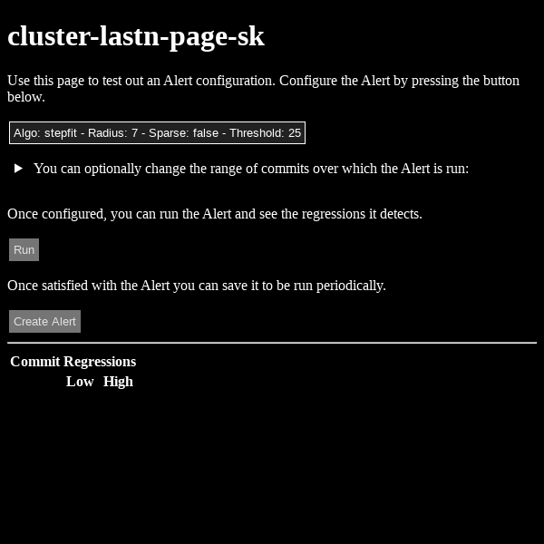
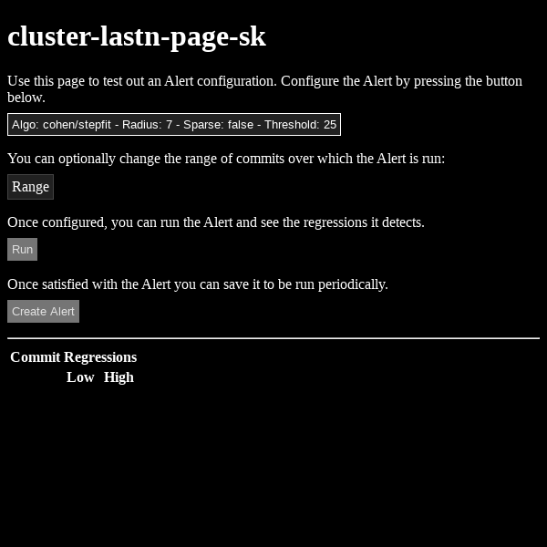

We need to talk about Shadow DOM. While the [Google official docs strongly encourage the use of Shadow DOM](https://developers.google.com/web/fundamentals/web-components/best-practices), I quite strongly disagree.

As an example, a couple weeks ago I realized I could style the `<summary>` part of a `<details><summary>` set of elements as a button, which would
look great and more readily indicate its function. You can see the improvement here:

Before:



After:



Thankfully I hadn't swallowed the party-line on Shadown DOM and [this](https://skia-review.googlesource.com/c/buildbot/+/322315/2/perf/modules/themes/themes.scss) is the full
set of CSS changes I had to make, just the following additions:

```
details {
  summary {
    display: inline-block;
    outline: none;
    padding: 4px;
    background: var(--surface);
    color: var(--on-surface);
    border: solid 1px var(--surface-1dp);
    cursor: pointer;
    list-style: none;
    margin: 8px 0;
  }

  summary::-webkit-details-marker {
    display: none;
  }
}

details[open] {
  border: solid 1px var(--on-surface);
  padding: 0 8px 16px 8px;
  background: var(--surface);
  margin: 8px 8px 8px 0;

  summary {
    margin-top: 8px;
    margin-bottom: 8px;
  }
}
```

Note that this _Style_ change _Cascaded_ across three controls, almost as if
that's what **CSS** was designed to do. If I had fallen into the Shadow DOM trap
I would have had to change the embedded CSS for every element that used
`summary` and `details`, and that's not even mentioning the [performance
penalty](https://bitworking.org/news/2018/02/shadow-dom-and-css/) I'd pay. So
please think twice before adopting Shadow DOM.
