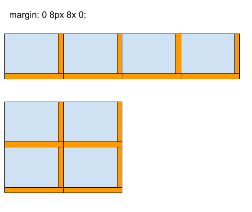

So I have been frequently frustrated when doing [CSS
flexbox](https://developer.mozilla.org/en-US/docs/Web/CSS/CSS_Flexible_Box_Layout/Basic_Concepts_of_Flexbox),
in particular, my margins, which may look good on a wide screen suddenly look
awful as the screen narrows. Instead of using media queries to change the CSS on
narrower windows I began to wonder if I was just missing something basic, so I
took some time to back up and think about the problem in general, and I can up with
the following default system:

```
    margin: 0 8px 8px 0;
```

The idea is to only set equal non-zero margins on the right and bottom of every
element and zero width margins on the left and top of each element. As you can
see no matter what size the screen becomes the elements will always have the
same margin between them. This works even if the elements are different sizes.



I'm sure I haven't invented anything new here, and if anyone knows a name for
this please let me know in the comments.
