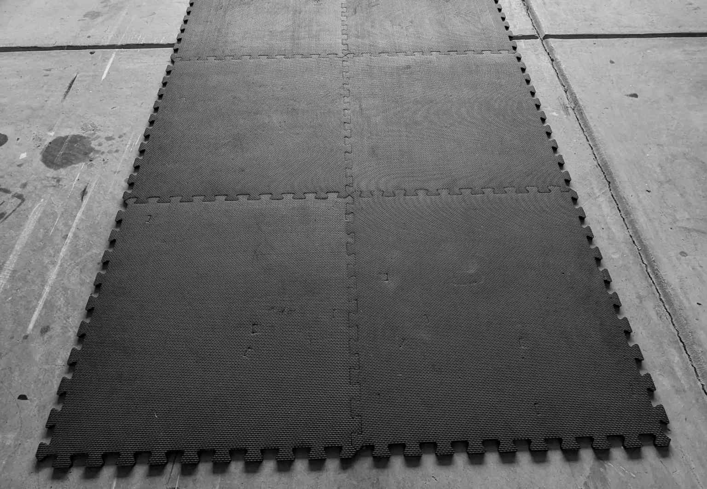
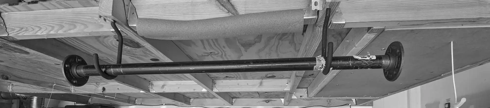
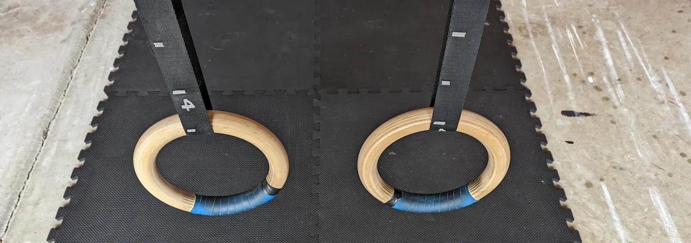
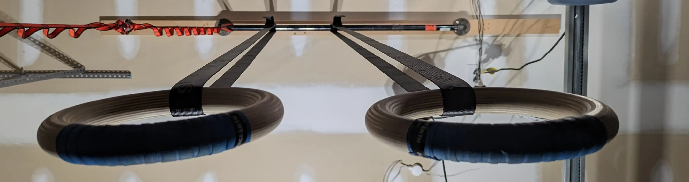

There's nothing like almost dying to really focus the mind.

My personal "2020" began back in Jan of 2019 when a long, lingering, and mis-diagnosed
case of diverticulitis caused my large intestine to tear, requiring emergency
surgery and nine days in the hospital, during which I lost 20 pounds, and had at least
five days straight where my heart rate was over 165.
If you are interested, I document that event in more detail in [A thing that happened](/news/2019/01/a-thing-that-happened/).

I came out of that event convinced that one of things that saved my life
was being in moderately good shape. I would go to the gym two or three times
a week before, but after I recovered I became fanatical, convinced that being in top
shape will be a critical component of my survival when, not if, I ended up
back in the hospital. So for the rest of 2019 into Jan 2020 I religiously hit the gym
every other day. I add the "not if" qualifier because upon talking to a few folks that
have had similar surgeries, the most common refrain I hear is, "Welcome to
the surgery train!", as it appears that revisions due to accumulated scar tissue, among other
reasons, might be a regular occurrence every 10 years or so.

So as Covid comes barreling down on us in 2020 I realize I'm not going back to the gym
for a long time, and I need to find a way to stay in shape using only what I have
in the house, which is some exercise mats:

And a length of black pipe held up by bicycle hooks as a pull-up bar:

Now this barebones setup took me a long way,  starting with workouts every day, in which I 
alternated between pull-ups and push-ups. After a few months I was able to regularly do
100 pull-ups or 100 push-ups in a single 30-minute workout. After hitting that milestone I started introducing
variations into the pull-ups and push-ups to make them more difficult, such as decline push-ups with
higher and higher supports for my feet, and L sit pull-ups, or pull-ups with wide or narrow hand grips.

By 2021 I needed to increase the challenge again and started adding in gymnastics rings, initially
hung from the pull-up bar:

These worked out great, as there's a *huge* difference between a decline push-up, and a decline push-up on rings.
Also, doing so many push-ups on a flat surface was starting strain my wrists, and the curved
grip of the rings was much better for my wrists.

Finally, early in 2022, I added a black-pipe mount to the ceiling of the garage,
allowing me a much larger range of heights I can use for the rings:

Since attaching and detaching the rings from the ceiling is a bit of a process, I bought a second
set of rings, one to keep attached to the ceiling mount, and another for pull-up bar.

The added height allows for more challenging exercises, such as upside down pull-ups, aka inverted ring dips,
and this summer, after a long stretch of doing negatives, I worked a [front lever](https://en.wikipedia.org/wiki/Front_lever) into my regular workouts.

In summary, this is a dirt-cheap setup that's also endlessly challenging.
