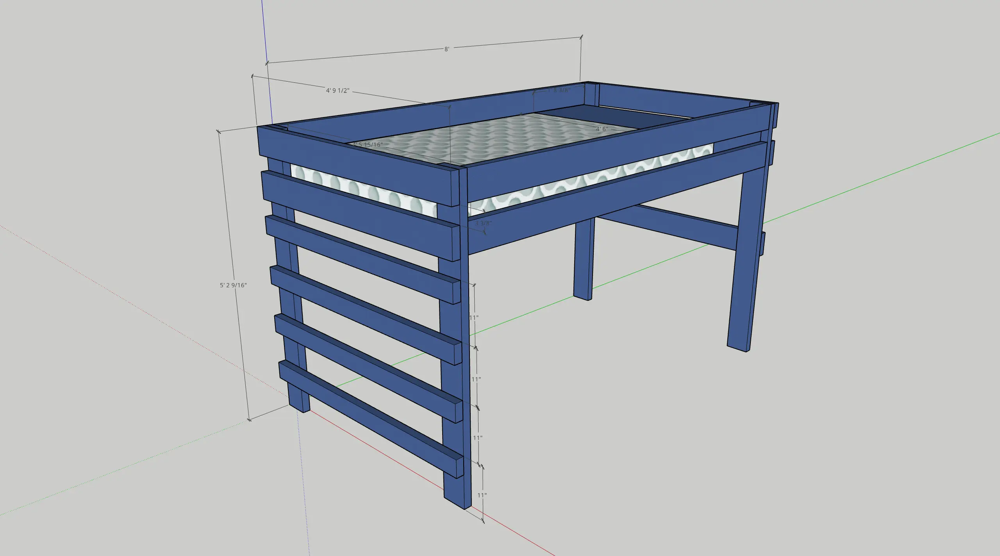
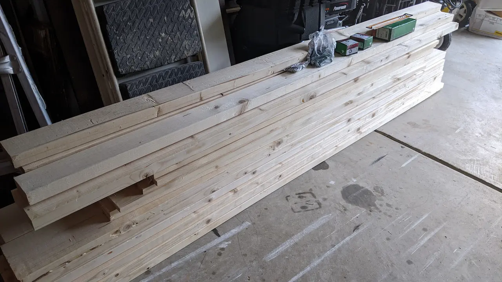
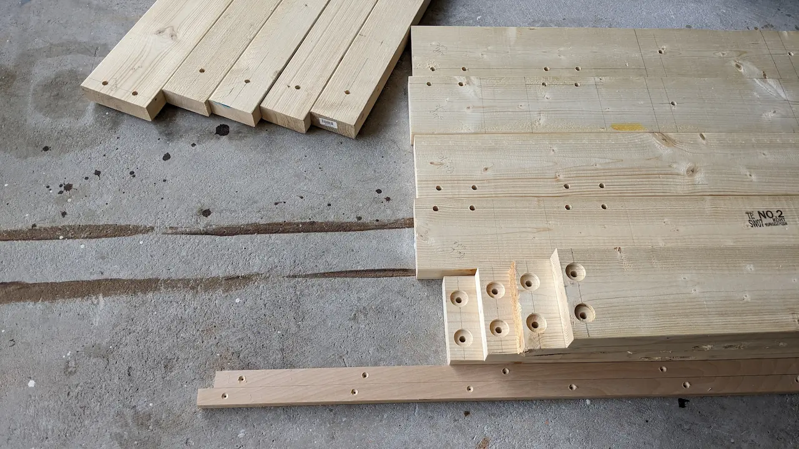
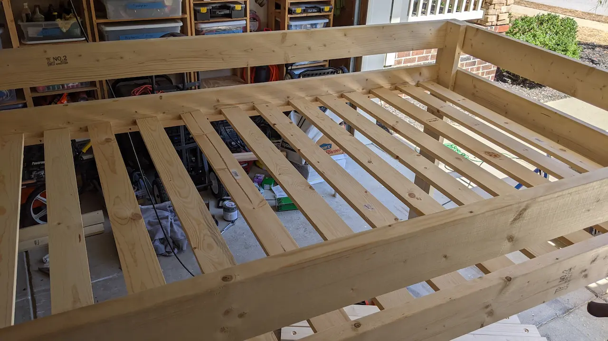
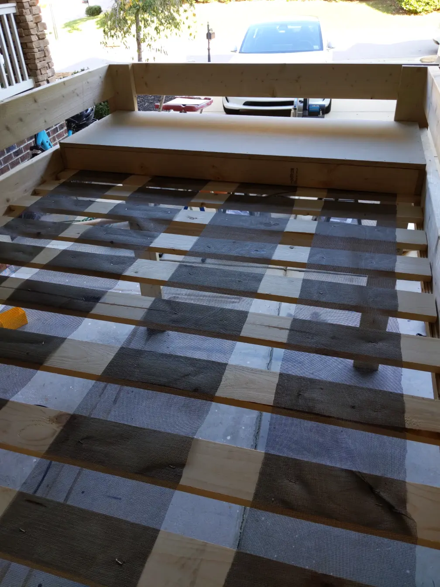
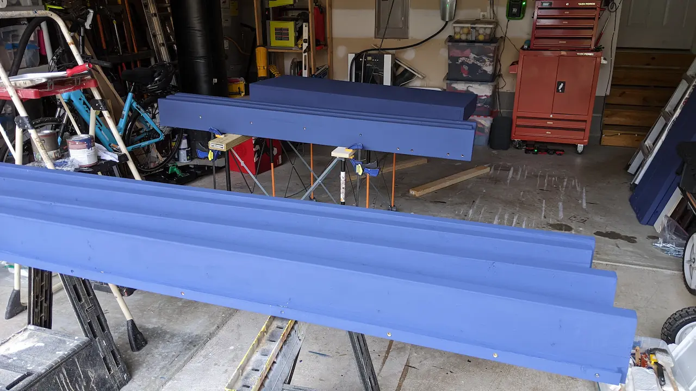
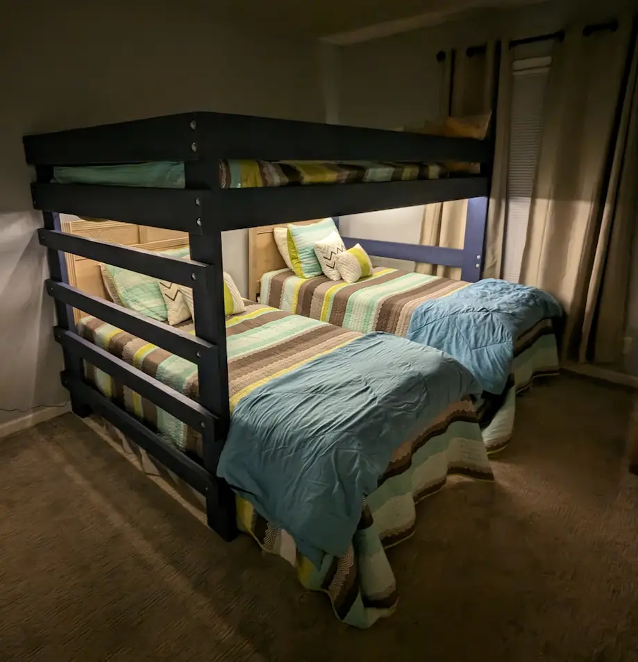

In this episode of "Woodworking with Joe", I build a bunkbed. We needed
a full size bunkbed that was also long enough to span two twin beds. After looking
around online we couldn't find anything that was both fit our dimensions and also
be rugged enough for under $1,500, so I designed and built this one for around $400.

I first designed out the bed in SketchUp:

Here is an [STL model if you would prefer that](https://github.com/jcgregorio/blog/blob/master/content/news/2023/01/bunk-bed/BunkBed.stl).

First, acquire all the materials.

Then cut to length and drill all the holes and countersinks.

Then assemble:

The mattress support slats are stapled into mesh screening so that they don't move under the
mattress. Since the bed frame is much longer than a full size mattress, I make a box of 3/4" plywood
to take up the remaining space.

Now it's just a coat or two of chalk paint, followed by a coating of wax:

This was all completed in October, but it wasn't until this last week that we
were able to make it down to the beachhouse to install it:

The addition of fairy lights installed on the underside of the bunkbed really
make the space below very cozy.