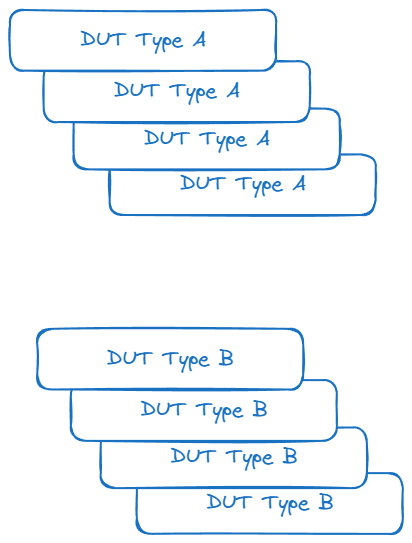

The main focus of my job for the last decade has been device testing, in
particular making sure the [Skia](https://skia.org) 2D graphics library renders
quickly and correctly across a huge range of machines, including Mac, Windows,
and Linux PCs, but also non-PC devices like Android and iPhone phones. This type of
cross-platform CI/CD system has a number of challenges

As the best practices of building large scale software have improved over the
years I've often wondered how a cross-platform testing system could be built
from off the shelf parts today.

Let's start first with defining some terms particular to device testing.
The first two terms are DUT and Host.

The host device is something familiar to us, usually a small PC running Linux
that we can network using Ethernet. In my case I prefer using RPis as the host
because they are small, cheap, and incredibly durable. The host is used as a
bridge to the DUT, or Device Under Test, and typically connects over USB or some
other slower connection choice, such as RS-232.

The point to take away from this is that when we are talking about testing some
software on a device we actually have two platforms to target, the host, and the
DUT. For example, the host could be an Intel NUC running Linux, while the device
could be an ARM based Android phone.

To simplify our diagrams, and for the sake of brevity, when I speak of a DUT going
forward I will usually be referring to both the host and the DUT as a single unit.

So when testing we are going to need a bunch of the DUTs to keep up with the
testing demand, and we may also have a variety of DUTs like in the case of Skia.
Even if you aren't testing across a huge variety of devices you may still have
different generations of the same hardware in your test lab, or you may want to
test across different versions of the operating system that runs on your DUT. So
a typical lab situation will look like the following.

Where the `type` could be an OS difference, a board revision, or an entirely
different class of device.
