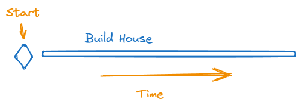

Let's talk about project planning. We'll start off with a large and complex
task, like building a house.

Note that we can decide when to _start_ building the house, but when we _finish_
the house is unknown. This is the entire point of project management, given a
start time and a task, figuring out when it will end. All of our efforts will
revolve around trying to reduce that ambiquity.

Sure, we will also track cost, resouce allocation, and other attributes of a
task as the project goes on, but that is almost always in service of a finish
time.

The fundamental nature of the ambiguity of the finish time of a task is
something I regularly see get lost in project management, and think that might
be caused, in part, by the tools we use to track project progress, in particular
the visial representation of that information. Look at the above image and see
the very definite end of the task. I think drawing the task in a slightly
different way would stress the ambiguity around the finish, for example:

Reducing uncertainty about the duration of a task is the fundamental mission of
project management.
