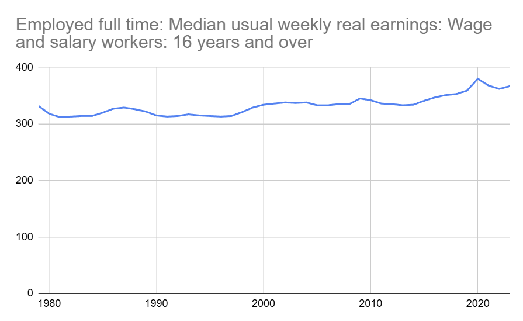
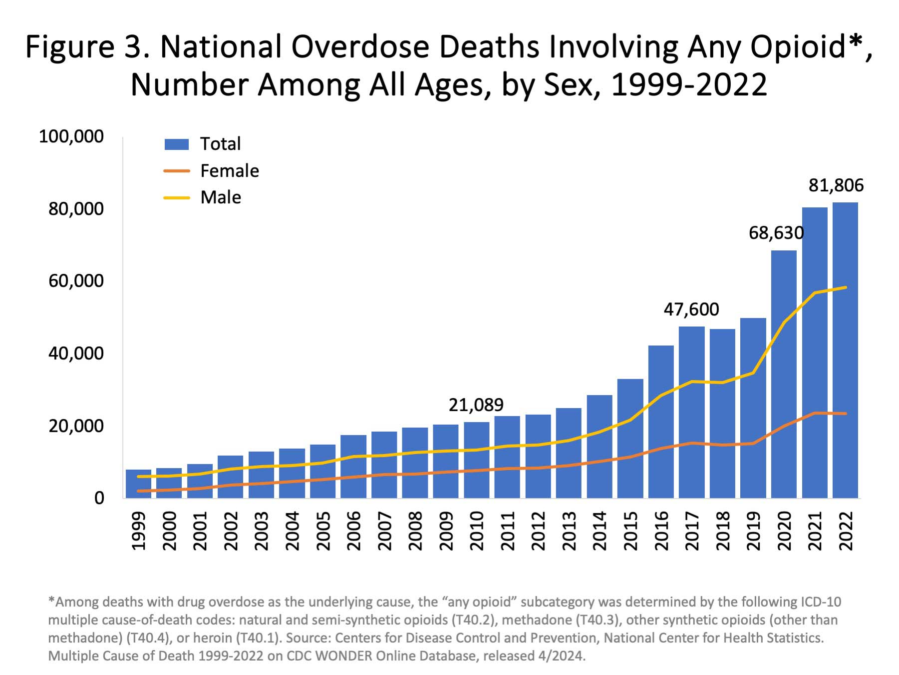

So Trump won the 2024 Presidential election, or more succinctly, Kamala Harris
and the Democratic Party _lost_ the 2024 presidential election and I blame
Obama.

> "Certainly the former president is in the far-right area, he's certainly an
> authoritarian, admires people who are dictators — he has said that. So he
> certainly falls into the general definition of fascist, for sure," Trump's
> longest-serving White House chief of staff John Kelly.
> https://www.axios.com/2024/10/23/john-kelly-trump-hitler

When someone who was there during the first Trump administration tells you that
Trump is a fascist, you should listen to them. I fully expect next four years to
be an absolute shit show that will definitely warp, if not break, our democracy.
But I want to talk about how we got here, because Democrats need to figure out
what went wrong and come up with a strong appealing alternative to Trumpism
before the mid-term elections if they want any chance to blunt the worst
excesses of the Trump administration.

## Stop otherizing

You may want to cast each and every Trump voter as a racist or white
supremacist.

First, that's otherizing, stop it. Sure, there are folks who fall into the
racist, misogynist, or full on white supremacists camps, and yes, the FoxNews
reality distortion field certainly has an effect, but I refuse to believe a
majority of Americans are like that, and the data is on my side.

The same voters elected Barak Obama as President. Twice.

And look at this very election in my home state of NC. While Trump won the
Presidential vote, NC also elected Democrats to a number of other statewide
offices, starting with Josh Stein, a Democrat, the first Jewish Governor of
North Carolina, who won by 14 points! We also elected Rachel Hunt, a woman for
Lieutenant Governor, Jeff Jackson for Attorney General, and Mo Green,
Superintendent of Public Instruction, and Elaine Marshall for Secretary of
State, and only one of those was an incumbent.

Also, Republicans lost their super-majority in the legislature so they can't
override the Governors veto.

If the voting was driven by racism and misogyny then the above results would
have been very different.

## What if?

The first thing to internalize is that Trump voter's grievances are real.

In [exit polls](https://www.nbcnews.com/politics/2024-elections/exit-polls)
Trump voters picked "The economy" and "Immigration" as their top issues. What if
we actually believed what they said? That the reason that they voted for Trump
was because they thought he was better for the ecomony then yet another
Democrat? If we suppose they are telling the truth, then what do they mean?

I've spent the last two years in Presidential-election-spin-room-hell having
everyone tell me how good the economy is, exclaiming, "Just look at the stock
market!".

To quote Kai Ryssdal, ["Also, the stock market is not the
economy."](https://x.com/kairyssdal/status/1822249482966253918)

These days, due to 40 years of non-existent anti-trust enforcement and the
resulting consolidation in the US economy, the stock market is a measure of how
efficiently corporations are strip-mining the US economy, and not how well
things are going on main street.

The graph below shows how productivity has continued to rise, but hourly
compensation has lagged further and further behind. Whether you call this the
Productivity-Pay Gap, or [a decline of workers’ relative
income](https://economicsfromthetopdown.com/2020/01/17/debunking-the-productivity-pay-gap/#:~:text=For%20that%20reason%2C%20I%20think%20the%20%E2%80%98productivity%2Dpay%20gap%E2%80%99%20needs%20to%20be%20called%20what%20it%20actually%20is%20%E2%80%94%20a%20decline%20of%20workers%E2%80%99%20relative%20income.),
it is real world trickle-down economics, where less and less of the friuts of
labor trickles down to employees:

<iframe src="https://fred.stlouisfed.org/graph/graph-landing.php?g=1zQrn&width=670&height=475" scrolling="no" frameborder="0" style="overflow:hidden; width:670px; height:525px;" allowTransparency="true" loading="lazy"></iframe>

But what does this look like from the bottom? Here's a chart of <q>Employed full
time: Median usual weekly real earnings: Wage and salary workers: 16 years and
over</q>, that is, inflation adjusted real earnings, which I've plotted here on
a chart that starts at zero, like the math gods intended:

 https://fred.stlouisfed.org/series/LES1252881600Q

Now, I don't want to get too technical, but I did get a degree in Mathematics from Dartmouth College
and there's a very precise term we use for the above graph, and that term is **A FLAT FUCKING LINE!**

And that flat line has had real world consequences.

Happy people with a future don't kill themselves via drug overdoses.

 https://en.m.wikipedia.org/wiki/File:US_timeline._Opioid_deaths.jpg

May I remind you the definition of insanity? Doing the same thing over and over
and hoping for a different result. For 40 years America's working class has been
stuck, going back and forth over those 40 years voting Republicans and Democrats
into office, both for President and Congress, and their lives have never
improved.

I don't believe these people aren't stupid, I believe they know damn well that
Trump isn't a Republican. You'll see articles where pundits will claim that
America took a turn to the "Right" with the election of Donald Trump, which is
utter horseshit. Trump, and the rest of the MAGA folks that have come into
office in the past eight years should have an (M) next to their name, not an
(R). The Republican party has gone the way of the Whigs and the Torries. I think
they clearly see Trump and MAGA as a totally new entity that might **actually**
affect change, or, at this point, burn it all to the ground, and they'd be happy
with either result.

## Obama

And now let's go back to Obama, where I lay a good deal of the blame. I mean,
the real blame for kicking off this slow descent into our modern Horatio Alger
dystopia is Ronald Reagan, but Obama actually had a chance to turn the corner
and reject the Neo-Liberal concensus draining the life from the US economy, and
instead he doubled down on it.

There are two incidents from Obama's presidency that have really stuck in my
craw for the last decade, the first is his exchange with Steve Jobs.

> During their meeting in 2010, Obama asked Jobs how to bring all the iPhone
> manufacturing jobs back to the United States, according to the New York Times.
>
> "Those jobs aren't coming back," Jobs replied. https://money.cnn.com/2012/10/17/technology/apple-china-jobs/

And Obama just accepts that answer! Utterly appalling. Instead of asking Jobs if
those jobs could come back to the US if a $500 per phone tariff was imposed on
them, he just blithely accepts it as a fact of nature. This isn't a singular
event, watch this interaction with Obama and a United Steel Workers union member
from Indiana.

<iframe width="560" height="315" src="https://www.youtube.com/embed/CKpso3vhZtw?si=mjmo16io9Wue0tBw" title="YouTube video player" frameborder="0" allow="accelerometer; autoplay; clipboard-write; encrypted-media; gyroscope; picture-in-picture; web-share" referrerpolicy="strict-origin-when-cross-origin" allowfullscreen></iframe>

Did you catch that? Eric's already lost his job after it was moved out of the
country and is asking Obama what he's going to do about it, and President
Obama's response is to flail like a helpless child and pronounce, essentially,
["I'm just a baby
duck!"](https://youtube.com/clip/UgkxlZLpp0KxfNisr1Nz5y0NtvaUgxFDV3Pz?si=6nXjf-mC2OsXtBl8)

The important takeaway here is that going against the neo-liberal concensus,
putting the American worker first, putting up barriers to exporting jobs to the
country with the cheapest pool of workers, stopping the strip-mining of the US
economy is not even countenanced. Here is a President elected on a promise of
change, and the actual change we needed is unthinkable, it is literally an
unthinkable thought.

Now put yourself in Eric's shoes, all the Eric's who have had their jobs moved
overseas for the past 40 years as corporations strip-mined the US economy for
ever larger short term gains, and ask yourself if you'd be happy with Obama's
answer.

And not only did Obama do nothing on that front, the same obsequiousness to
American corporations has continued in the Biden administration, to the point
that the [Biden Whitehouse would never talk about their anti-trust
work](https://www.thebignewsletter.com/p/why-does-the-biden-white-house-hate?utm_campaign=email-half-post&r=5tftr&utm_source=substack&utm_medium=email).
I will give Biden credit for actually appointing Lena Khan, but then to never
talk about her work shows the true depth of the fault line in the Democratic
party, supposedly the party of the working class, yet afraid to speak, or even
think, anything that might upset their corporate donors. Let's not even talk
about pro-union Biden [throwing railroad workers under the proverbial
bus](https://www.reuters.com/world/us/biden-signs-bill-block-us-railroad-strike-2022-12-02/).

## Reckoning

Despite the [protestations of Nancy
Pelosi](https://www.youtube.com/watch?v=O9fSK2AR594), I believe Democrats need
to think long and hard and come back to the American people with a solid plan
that actually addresses working class families, and [I'm not
alone](https://bitworking.org/news/2024/11/bernie-sanders-statement-on-democrats-losing-the-2024-presidential-election/).
And please don't try to tell me the party shouldn't do anything too _radical_,
the voters just put a convicted felon back in the White House.
