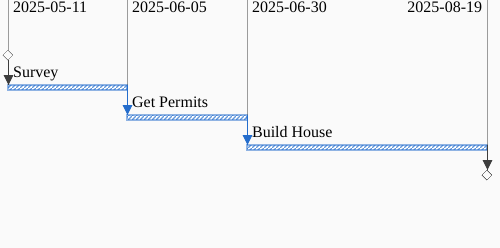

[The Fundamental Axioms of Project
Planning](../the-fundamental-axiom-of-project-planning/) introduced the two
fundamental axioms:

## The Axioms of Project Management:

1. Starting is definite, finishing less so.
2. Divide and conquer to reduce uncertainty.

So now let's apply that to an ambiguous task and see how we can break it down
into more manageable chunks. Let's start with the classic example of building a
house:

Now that's pretty ambiguous, we have really no idea how long that will take,
maybe anything from 3 months to a couple of years. As a first step let's split
this task in two on the time axis.

Here we can split the task, first getting the permits needed to
build the house, and then beginning construction.

Note the dependency between those two tasks and each one's uncertainty.

We can't start building the house until all the permits are secured. (Starting
is definite, finished less so.)

The uncertainty around getting the permits is a subset of the uncertainty around
the whole project and wil be much less than the original single task. (Divide
and conquer to reduce uncertainty.)

And we can further subdivide the "Get Permits" task, because before you do that
you need to know all about the lot you are building on. Again, we've take a task
and broken it down into two tasks in the time dimension, one task coming before
the other:

Let's assume we're building in an area without city water and sewer, so we'll
also need to plan and build out a septic system and know the dimensions of the
lot we're building on. Both of those can happen at the same time, in this case
think of splitting the original "Survey" task into two parallel tasks with each
task being done by separate people. The first "Survey" means getting a surveyor
out to survey the land, and the second task is getting a soils person out to
test the soils.

Finally, we can put together the final information we need for the permits once
we have both the survey and the soils report, at which time we can layout the
house envelope and the septic field. This is like a game of tetris as you try to
fit these things on the same lot, but still being aware of the setbacks, i.e.
the septic field should be at least 25 feet from the house, but also needs to be
100 feet from the water well, etc. But I digress, lets' get back to our chart.
All the work has to happen before the permit application, and after the survey
and soils report:

Note that at each step we are sub-dividing a task either in time or in
resources, specifying things that come before and after, or tasks that can take
place in parallel. And as each task gets smaller, the more the uncertainty will
shrink.

Now the diagrams you see above are called Gantt charts, and if you work in the
software field you'll know that a subset of people in the field will be begin
shuddering, averting their eyes and muttering "waterfall", "agile", and "scrum"
under their breath.

You see, somewhere in the distant misty past of software development people
stopped looking at Gantt charts not as the output of a process to reduce
ambiguity, but as a mandate from on high on how to exactly run a software
project. Or maybe some weak and ineffective managers decided to use the Gantt
chart as a command and control mechanism to manage software development. Either
way the original use of such a chart got labelled as "waterfall" development and
the word "waterfall" became vilified.

But that's completely wrong, and not how these charts came about. They were
invented to tackle large ambiguous projects, doing so from the bottom up, and
I've got the receipts to prove it.

Let's jump back to 1956, **almost 70 years ago!**, to the development of the
[Polaris Missle System](https://en.wikipedia.org/wiki/UGM-27_Polaris).

> The Polaris missile program's complexity led to the development of new project
> management techniques, including the Program Evaluation and Review Technique
> (PERT) to replace the simpler Gantt chart methodology.

Here's where we hit a little bit of complexity because language isn't fixed and
the meanings of words change over time. Back in 1956 a Gantt chart was just a
horizontal bar chart that did not include dependency relationships between
tasks. PERT came along and showed the importance and power of including the
relationships betwen tasks, so then Gantt charts started including inter-task
dependencies, and yet still retained the name "Gantt" chart.

A two part report was publishing on how the PERT process was computerized
and applied to the project:

[Program Evaluation Research Task (PERT) Summary Report - Phase 1](https://www.google.com/books/edition/_/bocPI2FOxJ0C?hl=en&gbpv=0)

Let's look at some key quotes from this document, stating on **page one**:

> Three factors, however, set research and development programming apart. First,
> we are attempting to schedule intellectual activity as well as the more easily
> measurable physical activity. Second, by definition, research and development
> projects are of a pioneering nature. Therefore previous, parallel experience
> upon which to base schedules of a new project is relatively unavailable.
> Third, the unpredictability of specific research results inevitably requires
> frequent change in program detail. These points are acknowledged by all
> experienced research people. Yet, even though it be ridiculous to conceive of
> scheduling research and development with the split- second precision of an
> auto assembly line, it is clear that the farther reaching and more complex our
> projects become, the greater is the need for procedural tools to aid top
> managers to comprehend and control the project.

Would it be bad form to point out that the entire edifice of "Agile" software
development is built on a bed of lies? Anyway, we can clearly see that the
entire point of the enterprise is to reduce ambiguity around research and
development work, the kind of work with the highest levels of uncertainty.

And this process is emphatically not a top-down process. Still on page one:

> This last point introduces a most important matter in research administration.
> The people most qualified to speak on what they have done, are doing, can do,
> and might do in a development project are the development people themselves.
> To interpose a substantial layer of evaluation organization between top
> management and the development people stretches the time of progress
> reporting, risks distortion of reports through successive interpretation on
> the way to the top, and generally adds to the remoteness of top management to
> the tasks it is managing. 1 A system should be a close coupling between the
> laboratory and top management and should serve both the planning and
> evaluation interests of both, each at the proper level.

And flexibility was baked in from the beginning, on page 3:

> Actual day-to-day happenings never follow the stated or "nominal" schedule
> exactly. They should bear a reasonable identity, but the "actual" schedule
> will continuously change and flex within the general limits of the nominal
> schedule.

Does it scale? Yes, yes it does, from page 4:

> The development of the FBM incorporates a tremendously complex system of event
> achievement. It is estimated that there may be upwards of 5,000 events which
> should be portrayed in the evaluation process. The computations that must be
> undertaken for each event as well as the interactions between events require
> something more than unabetted human contemplation . For this reason, the PERT
> procedure has been laid out so as to be compatible with processing on modern
> electronic computers.

The amusing part is that this project took place so long ago and the computers
were so slow that they spent a bunch of time and math speeding up the analysis
by _avoiding taking cube roots_. The bonkers thing is that folks have just been
copy and pasting the formulas on page 7 of the report to this very day as the
_right_ way to estimate task duration even though today we have computers powerful
enough to, _checks notes_, take cube roots.

Anyway, you should absolutely go read [Program Evaluation Research Task (PERT)
Summary Report - Phase
1](https://www.google.com/books/edition/_/bocPI2FOxJ0C?hl=en&gbpv=0), it's eye
opening how forward looking the project was, and how much we've lost, and then
poorly reinvented, since then.
