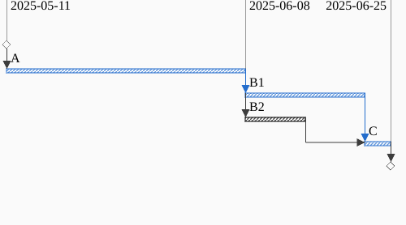

[Applying the Fundamental Axioms to Reduce
Uncertainty](../../03/applying-the-fundamental-axioms-to-reduce-uncertainty/)
walked through the steps of using divide and conquer to reduce a large complex
project into smaller inter-related tasks.

Now that we have our smaller list of tasks, one of the first thing you will want
to do is look at the critical path, that is, the longest set of tasks in your
plan that all depend on each other and define the longest path from start to
finish in your project.

Let's consider the following project, where we have tasks A, B1, B2, and C. Note
that B1 and B2 are both "successors" of A, i.e. A has to finish before they can
begin. Also note the B1 and B2 are "predecessors" of C, that is both of them
much complete before task C can begin. The final thing to note is that B1 takes
twice as long to complete as B2.

So if B1 takes four weeks to complete, B2 only takes two weeks to complete. In
this case the critical path of the project is `A -> B1 -> C`, which you can see
as highlighted in blue in the above chart. Any delay in A, B1, or C will delay
the completion of the project. On the other hand, if B2 takes a few days longer
than planned, actually anywhere up to taking twice as long, and the project will
remain on time.

The [critical path](https://en.wikipedia.org/wiki/Critical_path_method) is an
important tool in project planning because it tells you the tasks you really
need to monitor closely because they are the ones that determine the overall
project lengh. Also, these are the tasks you need to focus on when trying to
shorten a project. And who among us hasn't been on a project where you've 
planned to do the work in `X` days and you're asked, what would it take to
get it done in `X/2` days? 

In the above example how much effort should you put into shortening task B2?
Well, none, because even if  you got B2 down to just a single day, that will not
have any affect on when the project gets finished:

What you really want to focus on in this particular example is reducing the
length of task A. It clearly makes up a large portion of the project timeline
and reducing that task will have the largest impact on finishing the project
sooner.

That's the general idea of critical path analysis, find the critical path, then
find the "long poles" on that critical path, that is, the longest duration tasks
that appear on the critical path, and focus on shortening them to bring down the
total project duration.

While simply calculating the critical path will certainly help you run your
project, you must be aware of, and always on the lookout for, hidden critical
paths. Let's look again as our first example:

But now let's assign a level of `Uncertainty` to each task. In this case we will 
use [Jacob Kaplan-Moss](https://jacobian.org/2021/may/25/my-estimation-technique/)'s 
multipliers for measuring uncertainty:

| Uncertainty | Multiplier(Divisor) |
| ----------- | ------------------- |
| low         | 1.1                 |
| moderate    | 1.5                 |
| high        | 2                   |
| extreme     | 5                   |

So what does a `moderate` level of uncertainty mean? If we presume
a task has a duration of 6 days, then that task could be completed from
anywhere from the low side of $$(6 / 1.5) = 4$$ days, or on the high side
of $$(6 * 1.5) = 9$$ days.

If all the tasks in the project below have a `low` uncertainty except for 'B2'
which has an `extreme` level of uncertainty then (totally depending on what the
distribution of the uncertainty of B2 looks like), B2 may actually end up on the
critical path just as often as B1.

That is, B2 will complete somewhere between $$[(1w / 5), (1w * 5)]$$ or
somewhere in 3 to 35 days, and given that uncertainty in B2 there's roughly a
50% chance it's actually on the critical path.

While this might seem like a pretty academic exercise, looking for hidden on
critical paths was instrumental on getting one very large profile project to
finish on time: careful attention found a long pole task on a hidden critical
path that could be accelerated, which we did accelerate, which was lucky because
other parts of the project finished early and the hidden long pole did end up
being on the critical path and our acceleration of that task turned into a huge
win in getting the project done in time.